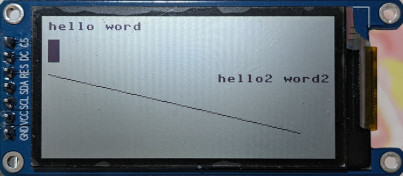
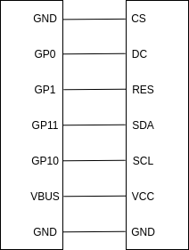
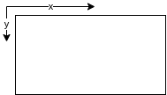

# ST7302-for-micropython
- arduino version see [https://github.com/zhcong/ST7302-for-arduino](https://github.com/zhcong/ST7302-for-arduino)
work for ST7302 lcd screen, and MCU is Raspberry Pi pico. ST7302 has a complex show conversion map and memory set command, see more in [this link](doc/ST7302_V0.0.pdf). And this driver have a partially update ability.


## 1、pin map

## 2、screen direction


## 3、how to use
```python
from machine import Pin, SPI
import framebuf
import Screen

spi=SPI(id=1, baudrate=10_000_000, polarity=0, phase=0, sck=Pin(10, Pin.OUT), mosi=Pin(11,Pin.OUT))

dc_pin=Pin(0,Pin.OUT)
rest_pin=Pin(1,Pin.OUT,Pin.PULL_UP)

screen = Screen.ST7032(spi, dc_pin, rest_pin, 250, 122)
screen.text('hello word', 5, 5)
screen.fill_rect(5, 20, 10, 20, 1)
screen.text('hello2 word2', 150, 50)
screen.line(5,50,220,100,1)
screen.flush_buffer()
```
more usage see `framebuf.FrameBuffer`
